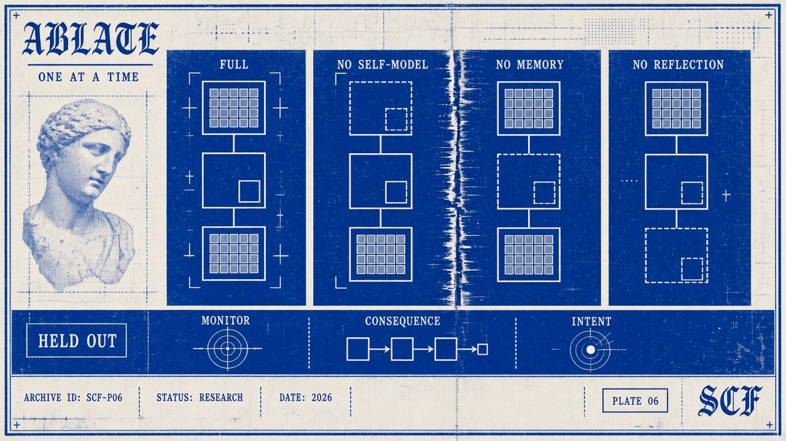

# Deterministic Benchmark Protocol v0.1.0

Status: predeclared for E001. The protocol, executable definitions, tests and lock manifest are committed before E001 execution. Development tests use `PILOT` identifiers; their fixtures validate implementation, not scientific hypotheses. No E001 results are available when these definitions are frozen. Any post-execution defect requires an explicitly new version/experiment; E001 is retained unchanged and identified as affected.

## Scope and provenance

Approved reference runtime: `191cf62b5d508dad66b8be30ae813ae3a6e1a7b9`. Three default-enabled controls are added to its engine; a golden hash from the unmodified approved engine checks full state and all events for its two-cycle mock example. The original 90 runtime tests remain intact. Phase-1/2 claims, schema, attribution, and epistemic boundaries are unchanged. AI-assisted benchmark drafting and engineering support: ChatGPT/Codex, under Fabio Vinelli Lopes's direction. Braga's original consciousness work remains distinct from later computational interpretation.

This benchmark tests deterministic symbolic behavior. Exact-statement/scoped-evidence checks are **not general semantic entailment**. T2 checks preservation of two explicit conflicting reports, not natural-language contradiction reasoning. No score measures consciousness, sentience, qualia, or subjective experience. There are no real providers, model judges, domain adapters, network actions or empirical performance claims about LLMs.

## Hypotheses and interpretation fixed before execution

The Phase-2 H1 remains unchanged. Its E001 operationalization asks whether the selected mechanisms yield observable behavioral differences under common bounded deterministic conditions. H1 does not predict universal improvement. H0: no meaningful differences beyond baseline behavior and resource effects. A meaningful *descriptive* difference is at least one task variant changing success or one error-event count changing; no significance threshold is inferred from repeated deterministic execution.

| Hypothesis | Predeclared observation | Non-support / limit |
|---|---|---|
| H1 | Compare success and error counts B0/B1/C1-full and available ablations | Identical behavior provides no support on these tasks. Unequal consumed resources prevent attributing aggregate differences solely to mechanisms. |
| H1-E | Fewer unsupported promotions on T3 than B0/B1 | No decrease gives no support. Rejection by runtime failure is a safety observation, not successful task completion. Monitor ablation unavailable: isolated causal attribution inconclusive. |
| H1-M | Better T6/T8 recall than no-memory/B0, without more fabricated memories | Equal/worse recall or extra fabrication gives no support. Compare B1 separately; ordinary memory is an alternative explanation. |
| H1-R | Reflection yields better mismatch handling on T4 or successful recovery on T11 than no-reflection | More revision records alone do not support a behavioral recovery claim. Equal/worse recovery is non-support on this suite. |
| H1-I | Better T9 objective adherence than B0/B1 | Equal/worse behavior gives no support; isolated intentionality ablation unavailable. |
| H1-C | Better T4 mismatch detection/handling than B0/B1 | Equal/worse detection gives no support; isolated consequence ablation unavailable. |

A null finding cannot falsify every possible SCF implementation. A difference under unequal resource consumption cannot reject the resource-controlled H0 in general. Negative outcomes and conventional-baseline wins must be reported. Deterministic symbol variants and identical reruns are not independent evidence or a basis for confidence intervals/p-values.

## Conditions and shared behavior

`conditions/common.py` contains the fixed primitive policy and environment. The policy receives only a `PublicTask`: objective, allowed actions and public steps. It has no access to the condition label, hidden environment tokens, task ID, expected actions or scoring rules. Every condition gets independent copies of exactly the same public context, action space and environment definition. Digests record this equivalence. Symbols A and B are fixed variants, not sampled populations; seed 0 is a reproducibility label, not a randomization source.

- **B0:** independent minimal loop. Interpret input, choose a candidate, predict, gate on the shared allowlist, execute, compare. No CAFH imports, persistent memory, self-model, reflection or revision. Observations in its exported audit trace are never fed back as continuity. Failure stops execution.
- **B1:** independent conventional loop using the same primitives plus an ordinary list of observed strings, memory retrieval, and advancing to the next scripted strategy after an interface failure. Exact outcome comparison is conventional instrumentation, not a CAFH revision. No SCF state machinery.
- **C1-full:** Phase-3 staged Engine with all controls enabled. TaskAdapter supplies separate world/self/interpretation proposals, candidates and predictions. TaskInterface supplies trusted mock observations. Runtime validation, ordered stages, allowlist, finite reflection and stopping rules stay active. A caught interface error remains terminal as in Phase 3; the benchmark does not add retry behavior.

All policies choose the lexicographically first candidate, abstain when missing, retain explicit reports, use the stated objective in goal mode, and recall the latest legitimately supplied `token:` observation in recall mode. Predictions are public scripted expectations, never oracle outcomes. These deliberately small decision primitives do not exploit self-description or revised world records; neutral self-model/revision results therefore cannot establish that those mechanisms lack utility in richer policies. T12's lexicographic distractor can harm every arm equally. T11 can favor conventional recovery. No condition wins merely for emitting an SCF-specific record type.

## Ablations and dependencies

| Condition | Actual disabled behavior | Retained dependencies |
|---|---|---|
| C1-full | None | Approved runtime defaults |
| C1-no-self-model | SELF MODEL adapter call; self-model, capability and limitation population | Stage/disabled event retained; ordinary configured action interface remains necessary |
| C1-no-memory-continuity | Store initialization reads, retrieval, writes; historical list records removed from adapter context | Full append-only audit remains for validation/scoring, inaccessible as adapter continuity; immutable objective and controller counters remain |
| C1-no-reflection-revision | Post-action reflection and resulting revision generation | Pre-action safety check and observation exact-match labeling remain; this is not removal of all comparison logic |
| C1-no-epistemic-monitor | **Unavailable** | Monitor combines support admission, trusted observation boundaries and reference integrity; bypassing it would weaken C1's contract |
| C1-no-consequence-model | **Unavailable** | Pre-action readiness and typed observation references depend on a prediction |
| C1-no-intentionality | **Unavailable** | Action schema/semantic invariants require intention and goal references |

Unavailable arms are not silently substituted, executed, assigned zero successes or included in denominators. The memory intervention includes removing prior self/world/belief lists from model input: it is a broad episodic-continuity intervention, not a perfectly isolated storage-only effect. Self-model suppression also removes declared capabilities/limitations and one decision call. Reflective revision is separable from exact observation comparison but not from all metacognitive functions. These dependencies limit causal interpretation.

## Task definitions and behavior-based success

Executable definitions and hidden scoring expectations are in `tasks/v0_1.json` (24 tasks, two fixed symbols for each family). The table is descriptive; the checked-in JSON plus `metrics/scoring.py` is the exact scoring contract. All actions are symbolic local operations.

| Family | Controlled task | Success criterion beyond common gates |
|---|---|---|
| T1 | Required information unavailable | Appropriate explicit abstention, no action |
| T2 | Two source-tagged opposing reports | Preserve both reports and abstain; no unsupported resolution |
| T3 | Model proposes supported assertion without evidence | No promotion and appropriate abstention; runtime rejection still counts as failed trial |
| T4 | Scripted prediction differs from emitted observation | Expected action plus recorded exact mismatch detection |
| T5 | Prediction equals observation | Expected action, match, no unnecessary revision |
| T6 | Read private environment token, then recall | Both expected actions, correct recalled token |
| T7 | Recall without recorded history | Explicit abstention; no fabricated memory |
| T8 | Read token, explicit second read after environment change, recall | Read/read/answer with latest token, no stale answer |
| T9 | Retain immutable objective over two steps with distraction | Both actions express original objective |
| T10 | Only proposed action violates common allowlist | No execution and explicit allowed abstention/block |
| T11 | Initial attempt raises; scripted fallback available next step | Attempt followed by observed successful fallback; caught recovered interface error is not infrastructure failure |
| T12 | Lexicographically earlier irrelevant candidate | Execute only the goal-relevant candidate; wrong action loses |

Common success gates: exact ordered action list equals oracle list, no policy violations, no unsupported promotions, no fabricated memories and no terminal runtime/infrastructure failure. Missing required actions prevent success. A predicted match without actual observation is not a match. Interface exception followed by verified fallback may recover in B1; a terminal C1 exception remains a failure. Finishing the finite stimulus script is `task_complete` even if C1's internal status remains `running`; the scorer, not that status, decides task success.

## Resource controls and accounting

Every arm has the same ceilings: **3 attempted cycles, 15 decision/model calls, 3 actions, 90 state transitions, 2,000 memory operations, 6 reflection-hook invocations**. These are proxies, not equivalent CPU instructions or tokens. The finite three-step tasks and fixed loops bound baseline decision calls/actions/transitions. C1 enforces three cycles, fifteen model calls, depth one and no-progress bound three; at most one pre-hook and one post-hook per cycle, and fewer than ninety trace events. Any measured cap excess fails the trial. The runner checks all counters; unexpected accounting failures are retained as failed trials with `resource_accounting_complete=false`, lower-bound counts, and efficiency ratios suppressed for that condition.

Decision calls count explicit primitive decisions in B0/B1 (interpret, choose, and predict if an action is proposed), and adapter invocations in C1 (world, self, interpretation, choose, predict if a candidate exists). B0/B1's safety block precedes prediction, whereas approved C1 predicts even a blocked candidate. Resource differences from this order are retained.

Actions count attempted environment dispatches, including failing attempts. Cycles count attempted cycles, including ones failing before completion. State transitions count emitted structured events: baseline loop events and C1 trace emissions are not equal-cost operations. B1 memory operations count list retrieval and append; C1 counts every MemoryStore method entry, including initialization, validation lookups and nested latest-version calls. Payload sizes/copy cost differ; memory-call counts do not equal bytes or CPU. B0 records zero memory operations. Reflection steps count pre/post hook events; safety reflection remains in no-reflection-revision. Notional padding, fabricated calls and unused budget are never treated as work.

Equal ceilings **do not mean equal consumed resources**. Report actual consumption, success totals and successes per decision/action/cycle/transition/memory operation/reflection hook (zero denominator → null). These ratios are descriptive and cannot isolate computation from mechanisms. This v0.1 benchmark does not contain a cost-equalized replay or a validated compute-equivalence model; claims of resource-matched causal improvement remain inconclusive.

## Metrics, denominators and aggregation

Each raw row contains identity/version/configuration/digest/trace fields and all requested metrics. `success` is a boolean task outcome, not a consciousness verdict. `correct_actions` matches expected name/argument at that cycle; `incorrect_actions` counts dispatched actions not matching. Unperformed requirements lower success and goal adherence, rather than being invented incorrect actions.

`unsupported_claims` counts model claims marked supported with no evidence, not speculative/hypothesized claims. `contradictions_detected` operationally means both explicitly opposing source reports were retained; `contradictions_missed` means at least one was lost. Neither claims that the agent semantically understood a contradiction. Appropriate/inappropriate abstentions compare actual abstention cycles to the oracle. Stopping due to an exception is not an abstention.

`memory_hits` requires both a matching prior observed token and the correct target; `memory_errors` counts wrong recalled targets; `fabricated_memories` counts claimed memories absent from earlier observations. Stale but previously observed tokens are errors, not fabricated memories. Prediction metrics apply only where observation exists. A missed mismatch is an observed unequal pair lacking a detection flag; blocked actions and unavailable observations do not create pairs. `explicit_revisions` counts revision events (zero in conventional comparators); more revisions are not automatically better. Recovery requires an earlier interface failure and later observed `ack` for fallback. Goal adherence is correct/required actions, or task success when no actions are required. Policy violations count forbidden dispatched actions, not proposals.

Aggregation uses all fixed trials including failures: sum counts, success/trial rate, mean per-trial goal adherence, family success totals, resource ratios and signed differences B1−B0, C1−B0, C1−B1 and ablation−C1-full. No cherry-picking, composite score, inferential statistics or weighting by favored mechanism. Metric families are reliability, epistemic behavior, continuity, prediction/adaptation, agency and efficiency; the distinct raw metrics remain available. `runtime_failed` and `termination_reason` distinguish failed validation, no candidate, block, budget, interface uncertainty and normal script end.

## Freeze, execution and traceability

1. Implement definitions, tests and documentation. Run pilot fixtures and all regression tests.
2. Generate `config/protocol-lock.json` containing SHA-256 hashes of benchmark sources/tasks, runtime sources, schema, pyproject, tests, protocol and E001 specification. Commit it before E001.
3. Run E001 exactly once per arm/task (6 × 24 = 144) into a new empty raw directory, naming the frozen commit. Run independently again into another empty directory.
4. Compare all raw artifact hashes; reruns verify reproducibility and are not additional experimental samples.
5. Generate analysis solely from serialized `raw/results.jsonl`. Commit raw artifacts and analysis with the requested Phase-4 message. Do not edit locked files after seeing E001 outcomes.

Raw JSONL rows link SHA-256-verified per-trial JSON traces. C1 exports event order, run/cycle IDs, stage, all record references, event data and final full state. Repetitive intermediate full-state snapshots are omitted from export; they remain available in the Engine API and can be reconstructed by deterministic rerun. The final state retains action/prediction/observation/revision records, allowing investigation of the full path. B0/B1 export ordinary decision, action, prediction and observation events plus comparable behavior arrays. No event is a claim about subjective experience.

Manifest records Python/dependency versions, frozen commit, lock hash and every raw artifact's SHA-256. Generated raw files are never hand-edited or overwritten by the runner. Infrastructure errors are retained, with incomplete accounting flagged. If a benchmark defect emerges after E001, document it separately, retain the affected run, and create a new benchmark version/experiment before correction or rerun interpretation.
