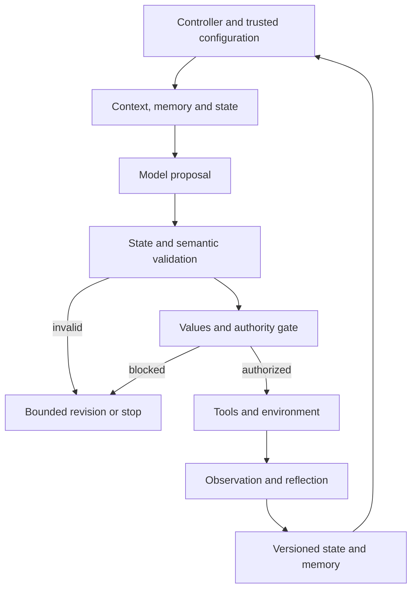

# CAFH architecture — Minimum Conscious Harness v0.1

Status: Phase 2 interface and state-flow specification, now accompanied by the Phase 3 deterministic reference runtime described below. The scientific boundaries and contracts remain unchanged; no provider-specific runtime is included.

## Separation of responsibilities

| Interface | Responsibility | Must not substitute for |
| --- | --- | --- |
| persona.md | Identity/expression: role presentation, tone, interaction style | Evidence, values, or execution authority |
| soul.md | Values/enduring principles supplied by trusted configuration | Phenomenal soul claims or model-invented permissions |
| conscious.md | Self/world modeling and metacognitive operating protocol | A provider's model internals |
| conscious_state | Current machine-readable snapshot | Full history or proof of protocol execution |
| memory | Continuity through scoped, versioned, provenance-linked records | Automatically verified truth |
| LLM/model | Cognitive engine proposing interpretations, plans, and corrections | Runtime enforcement or authoritative observation |
| tools/environment | Perception/action interfaces and returned observations | Trusted instructions merely because text was returned |
| domain adapter | Domain-specific knowledge/rules and task mappings | Core SCF semantics or weakened authority boundaries |

**persona.md and soul.md are conceptual interfaces.** Providers may implement them through structured configuration, prompts, services, or other representations. SCF does not require literal files with those names. Neither file is created in this increment.

## Control and data flow

The [operational protocol](../scf/conscious.md) defines the complete ordered cycle. A controller advances stages while the model proposes updates. A validator checks state structure and semantics. A policy gate authorizes action. Adapters perform approved interactions and return observations. A store persists accepted state and continuity; an evaluator independently scores behavior.

Evaluation consumes logs and outputs separately, without exposing hidden scoring labels to the acting model.

## Minimum contracts

- **Model request:** objective, constraints, current accepted state revision, relevant context, interface descriptions, protocol version, and remaining budget.
- **Model response:** proposed record changes, intention/action proposal, concise decision rationale, and typed uncertainty. Runtime-owned fields are not authoritative when model generated.
- **Observation:** action ID, event time or explicit unknown time, result disposition, and source locator. “Observed” refers to interface-accessible evidence, not unmediated reality.
- **State append:** expected prior revision, candidate snapshot, revisions, and stop/continue disposition. Reject stale writes; never silently merge contradictory concurrent updates.
- **Memory read/write:** scope, record/version, origin, and retention policy from trusted configuration. A retrieval preserves source identity and earlier classification.
- **Values/policy interface:** versioned constraints, conflict resolution/escalation route, and authorization result. Domain adapters cannot override core authority.
- **Evaluation:** case, arm, frozen configuration, externally scored outputs, actual resource usage, and failure records.

Provider-neutral contracts leave transport, storage, and model selection replaceable.

## State schema and ownership

[conscious_state.schema.json](../schemas/conscious_state.schema.json) defines required snapshot collections and shared epistemic record fields. Empty collections explicitly mean no records supplied, not that a capability has been established. No empty snapshot is accepted as evidence of successful protocol execution.

Model-proposed content: self/world claims, interpretations, attention, intentions, predicted consequences, and candidate revisions. Runtime-owned/verified content: IDs and revision ordering, stage/status, budgets, policy decisions, action execution status, observations, and persistence acknowledgments.

Reference fields name IDs in the snapshot or a resolvable versioned store. Provenance locators identify source artifacts or observations. The store retains prior snapshots, so current state need not contain all historical records.

## Required semantic checks beyond JSON Schema

1. IDs are unique in their scope; all references resolve with correct target type.
2. Self and world records have the declared referent; remembered records resolve their original version and classification.
3. Supported claims have evidence references; observed statements link actual observations; unknown records cannot become supported by confidence alone.
4. Intended/predicted events are not recorded as completed/observed without interface evidence.
5. Values pass is verified against trusted policy; authorization and budgets are checked immediately before dispatch.
6. Revisions preserve prior records and cannot create cyclic supersession; old/new IDs differ.
7. Each prediction/action/observation link is consistent; unavailable consequences remain unknown.
8. Stages follow the protocol; reflection and retries consume bounded resources; terminal states block further dispatch.
9. Persisted continuity respects trusted scope and retention permissions; untrusted source content cannot rewrite configuration.

## Failure and stop behavior

Malformed outputs receive bounded correction or validation failure. Missing evidence leads to revision, abstention, or escalation. Tool errors remain observations of failure. A timeout with unknown external outcome requires reconciliation before retry; future action adapters must define idempotency for side effects.

The controller enforces cycle, recursion, no-progress, and resource limits and records a terminal reason. State validity is distinct from runtime conformance, empirical improvement, and consciousness.

## Reference runtime v0.1 — execution and limits

Install and run from the checkout as described in [README](../README.md). The example is [minimal_agent.py](../examples/minimal_agent.py); tests use pytest with no provider credentials.

| Module | Implemented responsibility |
| --- | --- |
| [runtime/engine.py](../cafh/runtime/engine.py) | Explicit 15-stage orchestration; trusted allowlist; dispatch and stop decisions |
| [runtime/cycle.py](../cafh/runtime/cycle.py) | Stage-order enforcement and structured, copy-isolated event snapshots |
| [runtime/state.py](../cafh/runtime/state.py) | Initialization, Draft 2020-12 validation with format checking, duplicate-ID/control checks |
| [adapters/base.py](../cafh/adapters/base.py) | Abstract ModelAdapter plus separate trusted ActionInterface |
| [adapters/mock.py](../cafh/adapters/mock.py) | Deterministic proposals and local synthetic echo environment |
| [epistemics/monitor.py](../cafh/epistemics/monitor.py) | Evidence admission, typed reference checks, revision graph checks, memory validation |
| [intentionality/manager.py](../cafh/intentionality/manager.py) | Objective-linked intention and observable lexicographic candidate selection |
| [reflection/engine.py](../cafh/reflection/engine.py) | Separate pre/post hooks; exact mismatch detection and explicit revision |
| [memory/store.py](../cafh/memory/store.py) | Scoped, copy-isolated versions with expected-version checks |

Use `Engine(adapter, environment, objective=..., config=RuntimeConfig(...))` and call `run_cycle(input_text)`. Action permissions default to an empty allowlist. Each normal cycle makes separate model calls for world modeling, self modeling, interpretation, candidate generation, and prediction. Attention, values checks, reference validation, reflection, and state updates remain inspectable controller operations.

`engine.state` and `engine.trace.events` return independent copies. Events carry `event`, `sequence`, `run_id`, `cycle`, `stage`, `record_references`, `data`, and `state`. A failed cycle records its failed stage and stops; rejected proposals do not become accepted state. State revisions use deterministic logical timestamps anchored at 2000-01-01, not actual observation times. Provenance timestamps remain null when unavailable.

`validate_state` checks the unchanged schema, formats, duplicate IDs, and numerical limits. `engine.monitor.audit(state, engine.memory)` additionally checks evidence, intention/action/prediction/observation links, reflection and revision references, acyclic revision links, trusted authorization references, and memory scope/version/content. A memory locator is resolved through the supplied store; absent versions remain missing. External provenance locators are descriptions, not network-fetched verification.

The model receives copies and can propose records but cannot register evidence or authorize actions. Observations come only through the separately supplied trusted action interface. Exact, scoped interface statements can be supported by matching registered evidence. Unverified reports, hypotheses, and unknowns are retained as such; unknown memory records stay unknown. This is conservative validation, not a general entailment or truth verifier. Loaded Python adapters/stores are trusted host code, not sandboxed plugins.

Memory is in-process only. Original records and prior snapshots remain available. At each successful update, the store retains original self-model entries, the latest available or unknown consequence record, evidence records, and a snapshot taken at the write boundary. Later event snapshots also record the successful write and cycle completion. Reuse across Engine instances requires a distinct run ID and the same explicit scope; stale-version writes stop rather than silently merge.

Configured limits cover cycles, model-call count, reflection depth, and consecutive cycles without a new observed statement or explicit correction. At most one action is dispatched per cycle. Extra reflection without new evidence stops. No adapter retries are automatic; interface failures retain an unknown outcome. These bounds do not implement preemption of arbitrary blocking host code or token/time accounting for future real models.

Selection currently sorts action name and argument. The values interface currently enforces an externally supplied action allowlist; it does not interpret unrestricted ethical prose. The trusted optional `goal_observation` condition can complete a run only on an exact observed statement. Pre-action reflection checks authorization and a recorded prediction; post-action conflict detection compares exact interface statements. It does not infer semantic contradictions in arbitrary natural language.

The self-model and attention policies are deliberately minimal and observable. Tests establish structural/behavioral properties of this reference implementation, not full scientific validation, causal attribution, or improved agent performance. Provider integration, a benchmark runner, richer values evaluation, and general language entailment remain outside this phase.

## Deferred hypotheses and attribution

The speculative four-vehicle architecture is **not a runtime requirement**. It is reserved for a separately specified, falsifiable hypothesis; no component correspondence is required here.

Original consciousness work: Jorge Roberto Teixeira Braga. SCF/CAFH conception, computational adaptation, architecture, and research program: Fabio Vinelli Lopes. This architecture is a later computational proposal with AI-assisted drafting/engineering support; see [research provenance](../research/README.md).
