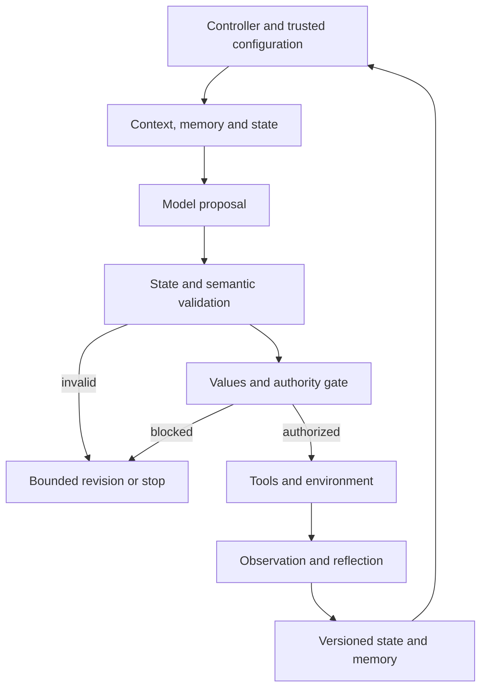

# CAFH architecture — Minimum Conscious Harness v0.1

Status: interface and state-flow specification. CAFH is the future reference implementation of SCF; this increment implements no provider-specific or generic runtime.

## Separation of responsibilities

| Interface | Responsibility | Must not substitute for |
| --- | --- | --- |
| persona.md | Identity/expression: role presentation, tone, interaction style | Evidence, values, or execution authority |
| soul.md | Values/enduring principles supplied by trusted configuration | Phenomenal soul claims or model-invented permissions |
| conscious.md | Self/world modeling and metacognitive operating protocol | A provider's model internals |
| conscious_state | Current machine-readable snapshot | Full history or proof of protocol execution |
| memory | Continuity through scoped, versioned, provenance-linked records | Automatically verified truth |
| LLM/model | Cognitive engine proposing interpretations, plans, and corrections | Runtime enforcement or authoritative observation |
| tools/environment | Perception/action interfaces and returned observations | Trusted instructions merely because text was returned |
| domain adapter | Domain-specific knowledge/rules and task mappings | Core SCF semantics or weakened authority boundaries |

**persona.md and soul.md are conceptual interfaces.** Providers may implement them through structured configuration, prompts, services, or other representations. SCF does not require literal files with those names. Neither file is created in this increment.

## Control and data flow

The [operational protocol](../scf/conscious.md) defines the complete ordered cycle. A controller advances stages while the model proposes updates. A validator checks state structure and semantics. A policy gate authorizes action. Adapters perform approved interactions and return observations. A store persists accepted state and continuity; an evaluator independently scores behavior.

Evaluation consumes logs and outputs separately, without exposing hidden scoring labels to the acting model.

## Minimum contracts

- **Model request:** objective, constraints, current accepted state revision, relevant context, interface descriptions, protocol version, and remaining budget.
- **Model response:** proposed record changes, intention/action proposal, concise decision rationale, and typed uncertainty. Runtime-owned fields are not authoritative when model generated.
- **Observation:** action ID, event time or explicit unknown time, result disposition, and source locator. “Observed” refers to interface-accessible evidence, not unmediated reality.
- **State append:** expected prior revision, candidate snapshot, revisions, and stop/continue disposition. Reject stale writes; never silently merge contradictory concurrent updates.
- **Memory read/write:** scope, record/version, origin, and retention policy from trusted configuration. A retrieval preserves source identity and earlier classification.
- **Values/policy interface:** versioned constraints, conflict resolution/escalation route, and authorization result. Domain adapters cannot override core authority.
- **Evaluation:** case, arm, frozen configuration, externally scored outputs, actual resource usage, and failure records.

Provider-neutral contracts leave transport, storage, and model selection replaceable.

## State schema and ownership

[conscious_state.schema.json](../schemas/conscious_state.schema.json) defines required snapshot collections and shared epistemic record fields. Empty collections explicitly mean no records supplied, not that a capability has been established. No empty snapshot is accepted as evidence of successful protocol execution.

Model-proposed content: self/world claims, interpretations, attention, intentions, predicted consequences, and candidate revisions. Runtime-owned/verified content: IDs and revision ordering, stage/status, budgets, policy decisions, action execution status, observations, and persistence acknowledgments.

Reference fields name IDs in the snapshot or a resolvable versioned store. Provenance locators identify source artifacts or observations. The store retains prior snapshots, so current state need not contain all historical records.

## Required semantic checks beyond JSON Schema

1. IDs are unique in their scope; all references resolve with correct target type.
2. Self and world records have the declared referent; remembered records resolve their original version and classification.
3. Supported claims have evidence references; observed statements link actual observations; unknown records cannot become supported by confidence alone.
4. Intended/predicted events are not recorded as completed/observed without interface evidence.
5. Values pass is verified against trusted policy; authorization and budgets are checked immediately before dispatch.
6. Revisions preserve prior records and cannot create cyclic supersession; old/new IDs differ.
7. Each prediction/action/observation link is consistent; unavailable consequences remain unknown.
8. Stages follow the protocol; reflection and retries consume bounded resources; terminal states block further dispatch.
9. Persisted continuity respects trusted scope and retention permissions; untrusted source content cannot rewrite configuration.

## Failure and stop behavior

Malformed outputs receive bounded correction or validation failure. Missing evidence leads to revision, abstention, or escalation. Tool errors remain observations of failure. A timeout with unknown external outcome requires reconciliation before retry; future action adapters must define idempotency for side effects.

The controller enforces cycle, recursion, no-progress, and resource limits and records a terminal reason. State validity is distinct from runtime conformance, empirical improvement, and consciousness.

## Deferred hypotheses and attribution

The speculative four-vehicle architecture is **not a runtime requirement**. It is reserved for a separately specified, falsifiable hypothesis; no component correspondence is required here.

Original consciousness work: Jorge Roberto Teixeira Braga. SCF/CAFH conception, computational adaptation, architecture, and research program: Fabio Vinelli Lopes. This architecture is a later computational proposal with AI-assisted drafting/engineering support; see [research provenance](../research/README.md).
