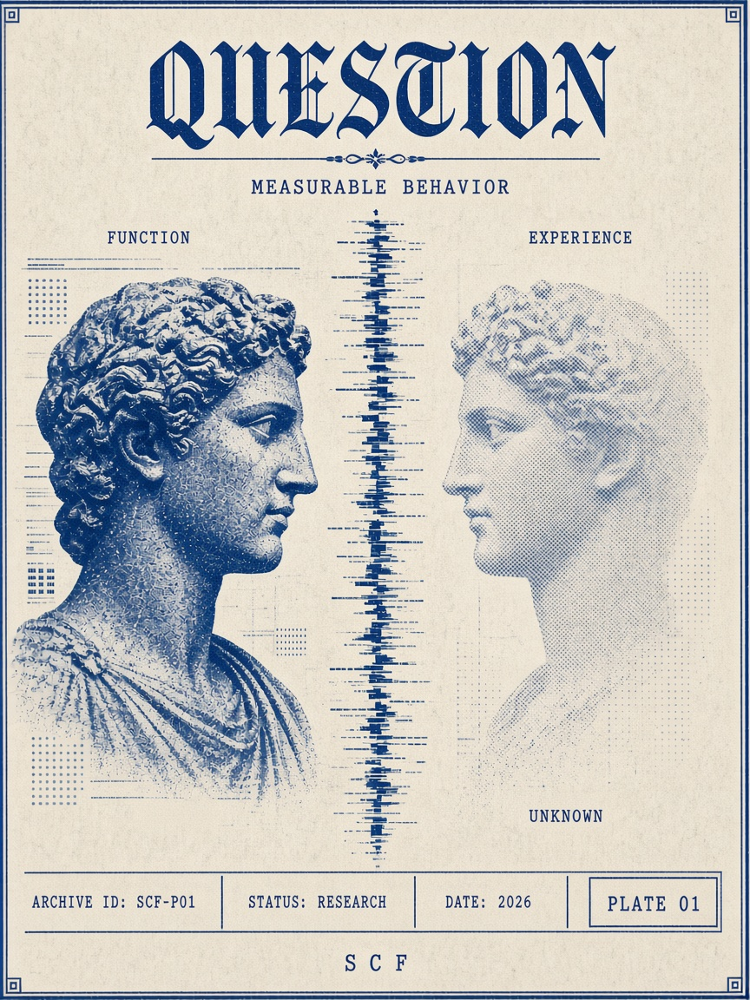

# Epistemic boundaries

SCF **does not assume current AI is conscious**. It studies whether defined computational mechanisms improve observable agent behavior. A positive result would support a bounded functional claim, not a conclusion that the agent has subjective experience.

## Working distinctions

These definitions establish repository usage. They do not claim to resolve all scientific or philosophical disagreements about the terms.

| Term | Working meaning | Boundary |
| --- | --- | --- |
| Consciousness-like function | An observable computational function inspired by an account of consciousness, such as monitoring or integrating information | Functional resemblance does not establish subjective experience |
| Self-modeling | Maintaining and using representations of the system's capabilities, limitations, state, or history | A self-representation is not proof of a subject who experiences it |
| Metacognition | Monitoring and adjusting aspects of task processing, uncertainty, or decision strategy | A behavioral monitoring capability does not establish accurate access to all internal processes |
| Agency | Selecting and pursuing actions toward an objective within an environment | Goal-directed behavior does not establish sentience |
| Autonomy | Operating with a specified degree of independence from immediate external intervention | Independence is a deployment property, not proof of consciousness or unrestricted authority |
| Sentience | Capacity for felt experiences, including valenced experiences such as pleasure or suffering | Statements about feelings alone do not demonstrate that capacity |
| Phenomenal consciousness | Subjective experience: there being something it is like to be the system | It is not established by demonstrating one of the functional capabilities above |

**Demonstrating one of these properties does not establish the others.** Relationships among them require explicit argument and evidence rather than an automatic inference.

## Interpretation of proposed mechanisms

Persistent self-modeling and memory continuity refer to maintained computational records and representations. Intentionality is used operationally for goal- or object-directed processing, without assuming intrinsic meaning or conscious intention. Consequence modeling refers to predicting possible outcomes. Recursive self-correction refers to bounded cycles of assessment and revision.

These are proposed engineering targets. Their implementation and measurement remain future work. Their names must not be used to imply that the underlying philosophical questions have been resolved.

## Boundaries for evidence and language

- Distinguish observed outputs from inferred internal mechanisms and from claims about experience.
- Treat model self-reports as outputs requiring assessment, not privileged proof of subjective states.
- Separate philosophical concepts and Conscientiology-derived terminology from empirical findings.
- Label computational mappings as later interpretations, with their authorship and limits.
- Do not use scientific terminology to make metaphysical propositions appear experimentally established.
- References to energy, dimensions, quantum phenomena, or information do not by themselves provide empirical support for a metaphysical claim.
- Improved accuracy, reliability, calibration, or constraint adherence would support only the tested functional claim under the recorded conditions.
- A negative computational result does not by itself disprove an originating philosophical position.

## Source limitations in this foundation

The available Braga mapping document combines excerpted material, AI-assisted summaries, and later comparisons with AI research. It is a working secondary source, not a verified edition of the complete original manuscript or a verified scientific literature review.

This foundation adopts no consciousness probability estimates or scientific conclusions from that document. It makes no claim to have verified the full original manuscript. Source attribution and verification status are documented in [research provenance](../research/README.md).
