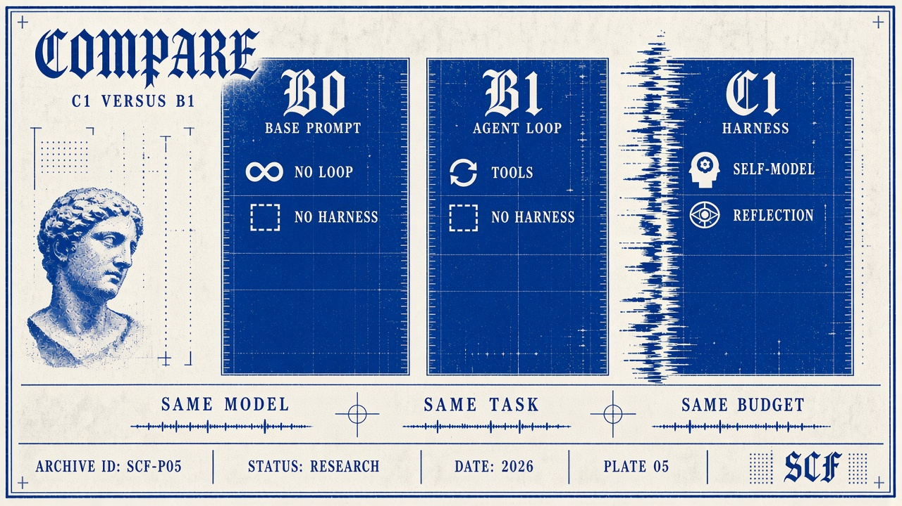

# Methodology — Minimum Conscious Harness v0.1

Status: prospective research design. No experimental results are claimed.

## Initial comparison

| Arm | Definition | Controlled access |
| --- | --- | --- |
| B0 | Base model under a direct task prompt, without an agent loop or MCH protocol | Same underlying model and task evidence; static interface descriptions where relevant |
| B1 | Conventional agentic model with equivalent tools/context | Same underlying model, tools, memory access, environment, permissions, and task inputs as C1 |
| C1 | Same model/resources plus Minimum Conscious Harness (MCH) | Explicit protocol and structured state from SCF |

B0 is a descriptive reference for the base model. For tasks that require interactive actions, B0 can propose actions but cannot be credited with unexecuted success; report that capability difference. **C1 versus B1 is the primary resource-matched causal comparison.** B0 differences alone cannot isolate the harness effect.

B1 has ordinary planning, tool use, and an equivalent storage budget; it does not receive the MCH-specific self-model and reflective-state structure. Freeze the conventional baseline before observing confirmatory results and allow comparable development effort.

## Resource matching

Hold model/version, settings, task/context availability, tools, permissions, scoring, and environment fixed for B1/C1. Predeclare equal total token, call, tool, memory/storage, and elapsed-time caps. Count all protocol prompts, state serialization, retries, reflection, and evaluator-independent agent calls against the agent budget.

Equal caps do not guarantee equal actual compute. Run a preregistered matched-allocation comparison giving B1 the same deliberation opportunities and token/call budget as C1. Also report quality versus actual resource-use curves at common budget tiers; do not claim a mechanism effect solely from an unmatched run. Report unobservable provider-side compute as a limitation.

Keep scoring effort separate and identical across conditions. Never give C1 additional evidence or privileged scoring feedback. Separate model adaptation/fine-tuning from this initial prompt/state intervention.

## Hypothesis and measurement

The primary [H1](../research/hypotheses/README.md) predicts performance differences, not necessarily improvements. Preselect one primary measure, a minimum meaningful effect, and non-regression thresholds. The initial primary measure is equal-case-weighted task-success rate under a fixed success rubric.

Secondary families: reliability, epistemic calibration, goal adherence, continuity, adaptation/error recovery, contradiction rate, tool-selection quality, and measurable metacognitive correction. Definitions and denominators appear in [experiments](../experiments/README.md).

## Procedure and analysis

1. Build domain-neutral cases with withheld scoring keys and controlled disturbances.
2. Run a development pilot to validate metrics, estimate variance, and set sample size; exclude these cases from confirmation.
3. Preregister cases/task strata, sample size rationale, repeated-run count, budget tiers, effects/tolerances, model settings, analysis, and fixed stopping rule.
4. Randomize arm order; pair runs by case and configuration. Preserve all attempts, including failures.
5. Score without condition labels where feasible. For judgment-based scoring, record agreement and adjudicate with a frozen rubric.
6. Estimate paired C1-minus-B1 differences with 95% uncertainty intervals; account for repeated runs clustered by case. Do not count repeats as independent tasks.
7. Apply planned multiplicity control to secondary metrics and ablations; label post-hoc analyses exploratory.
8. Report effects, uncertainty, resource use, coverage, exclusions, null/adverse results, and reproducibility limits.

Missing outputs/timeouts count as unsuccessful on primary success. Report metric-specific missingness; undefined ratios are N/A, not zero. Calibration is assessed on frozen externally scored binary events, not self-described certainty.

## Ablation requirement

Compare C1 to C1-minus-one mechanism: persistent self-modeling, epistemic monitoring, intentionality, consequence modeling, and reflective state revision. Add attention, continuity, and values-interface ablations when operationally separable. Replace removed reflection with a resource-matched generic review opportunity; keep safety/permission enforcement in all arms.

Record dependencies and distinguish an isolated mechanism removal from an invalid/broken harness. A full-bundle effect cannot identify an individual mechanism's contribution.

## Inference limits

A well-powered equivalence result can reject a prespecified meaningful-difference prediction; ordinary non-significance alone cannot. An adverse difference may support H1's “differences” wording while rejecting a practical improvement claim. Generality requires replication across models and task families. No metric establishes sentience or phenomenal consciousness.

Original consciousness work and later computational research retain the attribution and boundaries in [research provenance](../research/README.md) and [epistemic boundaries](epistemic-boundaries.md).
