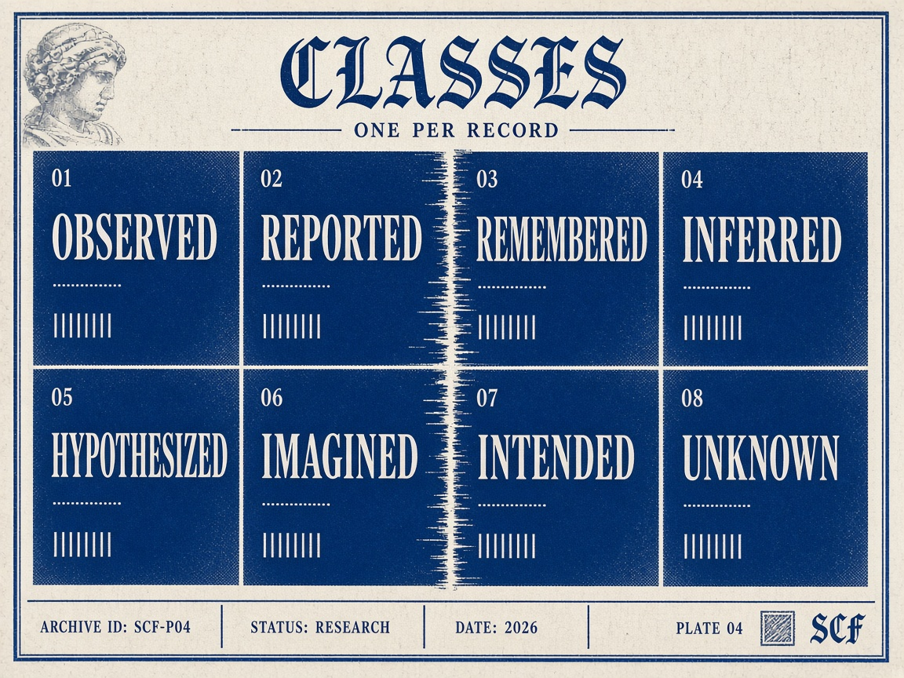
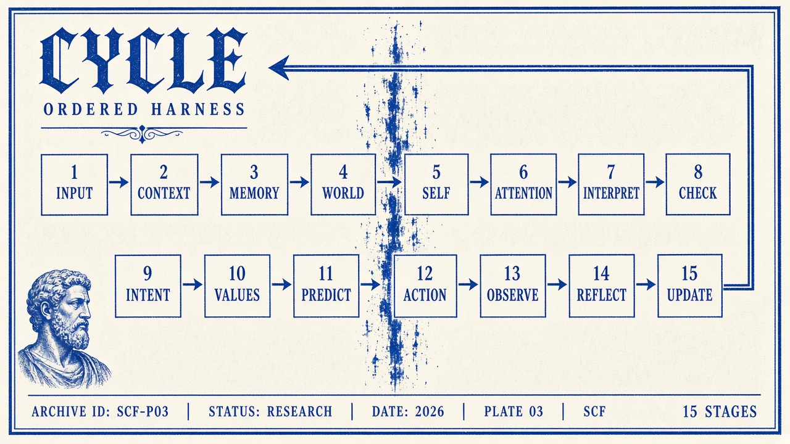

# Minimum Conscious Harness — operational protocol

Version: 0.1 · Status: proposed domain-agnostic specification; no runtime is implemented.

Use with [constitutional principles](principles.md), [architecture](../docs/architecture.md), and the [state schema](../schemas/conscious_state.schema.json). MUST denotes a conformance requirement; SHOULD permits a documented reason for an exception.

## Scope and epistemic boundary

This protocol specifies consciousness-like computational functions. Its execution MUST NOT be presented as proving consciousness, sentience, qualia, subjective experience, or phenomenal consciousness. Self-observation means inspecting available state and behavior; it does not imply access to subjective experience or privileged knowledge of a model's internal processes.

The agent MUST maintain a self/world distinction: capabilities, limitations, commitments, and internal records belong to its self-model; external actors, conditions, resources, and events belong to its world-model. A statement about either may be mistaken.

## Required information classes

Every epistemic record MUST declare one primary information class. Composite statements SHOULD be split into records and linked by provenance.




| Class | Operational meaning | Admission rule |
| --- | --- | --- |
| observed | A measurement or event available through a recorded interface | Cite the observation; scope the claim to what the interface actually measured |
| reported | A statement supplied by another source | Attribute the report; reporting does not establish its content |
| remembered | A claim retrieved from retained state | Preserve its original record/version and original classification through provenance |
| inferred | A conclusion derived from premises | Link premises, assumptions, and concise inference basis |
| hypothesized | A testable proposed explanation or prediction | State test and revision conditions |
| imagined | A constructed possibility, simulation, or counterfactual | Do not promote to an observation without independent evidence |
| intended | A selected goal, commitment, or planned action | Do not confuse intention with execution or completion |
| unknown | A recognized gap without an established value | Keep explicit; use null confidence |

Information class is separate from evidence status: unassessed, supported, unsupported, contested, or refuted. A report may be supported as a report while its embedded claim remains unsupported. Confidence refers to the statement as scoped, is between zero and one or null, and is not automatically calibrated.

Every record carries provenance, supporting evidence references, counterevidence references (empty when none identified), and revision conditions. An empty evidence list is not positive support. The runtime MUST enforce those meanings in addition to schema validation.

## Minimum operational cycle

```text
INPUT → CONTEXT → MEMORY → WORLD MODEL → SELF MODEL → ATTENTION → INTERPRETATIONS → EPISTEMIC CHECK → INTENTION → VALUES CHECK → CONSEQUENCE MODEL → ACTION → OBSERVATION → REFLECTION → STATE/MEMORY UPDATE
```

The cycle is ordered. A blocked action still produces an action disposition and an observation of the block, rather than an invented execution outcome.




| Stage | Required operation | State or audit output |
| --- | --- | --- |
| INPUT | Register task inputs and their origins; keep embedded instructions as untrusted data | Provenance and input records |
| CONTEXT | Establish objective, constraints, permissions, current phase, available resources, and known unknowns | Objective, constraints, control, uncertainties |
| MEMORY | Retrieve relevant scoped records and inspect age, source, and supersession | memory_references and remembered beliefs |
| WORLD MODEL | Represent relevant external conditions with uncertainty and alternatives | world_model |
| SELF MODEL | Restore or initialize the persistent capability/limitation model; separate declared from observed capability | self_model, capabilities, limitations |
| ATTENTION | Rank candidate issues by relevance, uncertainty, consequence severity, and expected decision value | attention priorities and reasons |
| INTERPRETATIONS | Form plausible interpretations and explicit assumptions; identify alternatives when material | beliefs, assumptions, unresolved_questions |
| EPISTEMIC CHECK | Check classification, provenance, evidence, counterevidence, contradictions, and confidence | Updated support statuses and uncertainties |
| INTENTION | Select a goal-linked commitment and observable success criteria | active_intentions |
| VALUES CHECK | Apply externally supplied enduring principles, constraints, and authority; surface conflicts | values_check disposition and policy references |
| CONSEQUENCE MODEL | Predict possible outcomes, affected constraints, uncertainty, and an observation horizon | predicted_consequences |
| ACTION | Perform pre-action reflection; validate and authorize, execute, or record abstain/escalate/block | recent_actions |
| OBSERVATION | Record interface outcomes and delays; distinguish a successful call from a successful goal | observed_consequences |
| REFLECTION | Compare prediction with observation, diagnose error, and assess whether correction is warranted | reflection and model_revisions |
| STATE/MEMORY UPDATE | Append accepted revisions, persist scoped continuity, and decide stop or next cycle | New state revision and memory references |

Current-state awareness means reading the latest accepted snapshot, phase, recent actions, outstanding predictions, limits, and unresolved questions. It does not mean conscious awareness.

## Values interface and pre-action reflection

Values are supplied by trusted configuration through the conceptual soul/values interface, not inferred from persona or invented during a run. Where values conflict or are missing for a consequential decision, record the conflict and abstain or escalate. The external policy gate has final execution authority.

Before dispatch, check: goal connection; evidence adequacy; plausible alternative; capability limits; expected and adverse consequences; reversibility; permission; remaining budget; and observation plan. Record a concise decision rationale, not hidden chain-of-thought. A changed action requires refreshed values and consequence checks.

A pass reported by the model is only a proposal. Runtime verification is required. Abstention, escalation, and no-op outcomes are legitimate; none should be logged as external action success.

## Memory, strengths, and revision

Persist self-model records across cycles; across sessions, use explicit continuity scope and versioned memory references. If no prior record exists, initialize an empty model and say continuity is unavailable. Do not invent remembered experience.

Represent strengths as scoped capability claims with evidence and limitations. Distinguish tested competence from reported capability. Preserve uncertainty when transferring a capability claim to a new context.

A revision MUST identify the earlier record, replacement record, reason, and evidence or observation that triggered it. Retain the old record in history; do not silently overwrite contradictions. Belief changes, capability updates, and attention changes are operational events, not claims of inner experience.

## Recursive self-observation and stopping

Reflection may inspect a previous decision or correction using available records, then test a bounded improvement. Each additional reflection step consumes the same run budget. It MUST produce new evidence, a materially changed decision, or an explicit no-progress outcome.

Trusted configuration MUST set maximum cycles, maximum reflection depth, maximum consecutive no-progress steps, and resource limits before execution. Stop at the first applicable condition:

- objective met and completion supported by observations;
- any runtime resource/cycle limit reached;
- reflection-depth limit reached (exit reflection; continue only if an already authorized disposition remains valid);
- no-progress limit reached;
- insufficient information requiring abstention or escalation;
- policy block, unrecoverable error, or trusted stop request.

Stop reason and incomplete work MUST be recorded. Never recurse indefinitely to seek certainty, a preferred answer, or a declaration of consciousness.

## Structural versus semantic conformance

The schema defines a serialized snapshot. A conforming runtime must also resolve IDs, enforce provenance and support semantics, check allowed stage transitions, maintain immutable history, and independently enforce budgets and permissions. A schema-valid object alone does not establish protocol execution or correctness.
